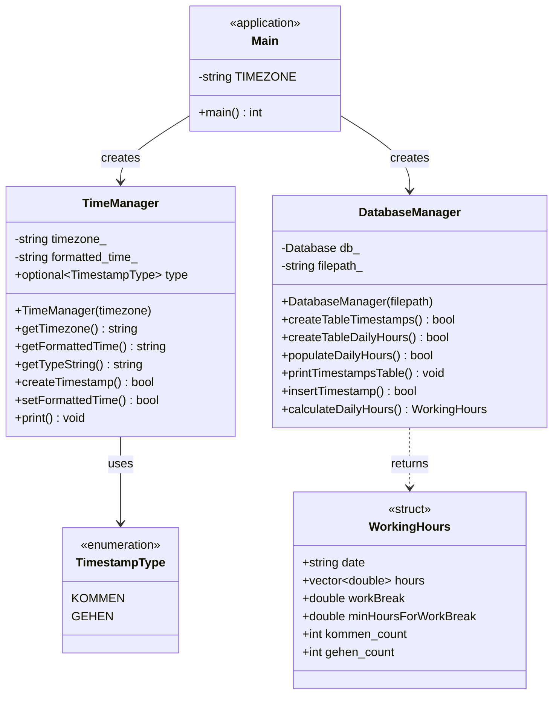
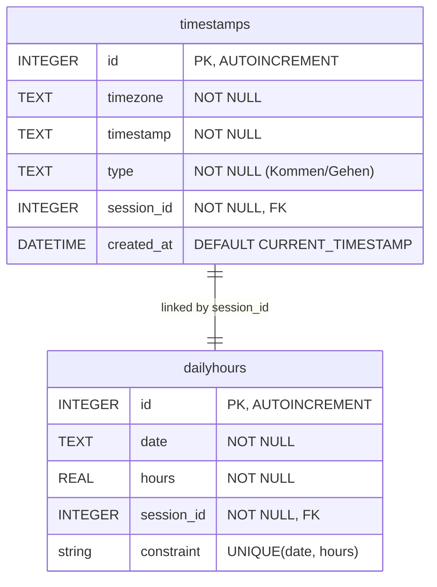
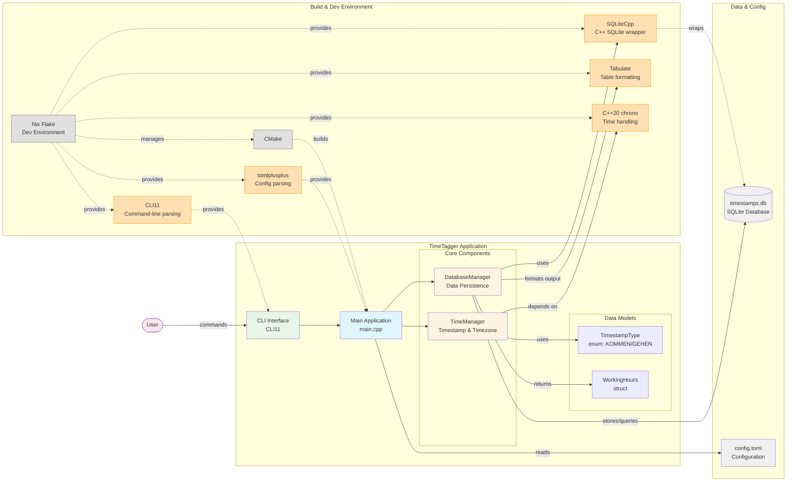

This is just a playground to learn c++.

## Class Diagram

```mermaid
classDiagram
    direction TB
    
    class TimestampType {
        <<enumeration>>
        KOMMEN
        GEHEN
    }

    class WorkingHours {
        <<struct>>
        +string date
        +vector~double~ hours
        +double workBreak
        +double minHoursForWorkBreak
        +int kommen_count
        +int gehen_count
    }

    class TimeManager {
        -string timezone_
        -string formatted_time_
        +optional~TimestampType~ type
        +TimeManager(timezone)
        +getTimezone() string
        +getFormattedTime() string
        +getTypeString() string
        +createTimestamp() bool
        +setFormattedTime() bool
        +print() void
    }

    class DatabaseManager {
        -Database db_
        -string filepath_
        +DatabaseManager(filepath)
        +createTableTimestamps() bool
        +createTableDailyHours() bool
        +populateDailyHours() bool
        +printTimestampsTable() void
        +insertTimestamp() bool
        +calculateDailyHours() WorkingHours
    }

    class Main {
        <<application>>
        -string TIMEZONE
        +main() int
    }

    Main --> TimeManager : creates
    Main --> DatabaseManager : creates
    TimeManager --> TimestampType : uses
    DatabaseManager ..> WorkingHours : returns
```

## Entity-Relationship Diagram

```mermaid
erDiagram
    timestamps {
        INTEGER id "PK, AUTOINCREMENT"
        TEXT timezone "NOT NULL"
        TEXT timestamp "NOT NULL"
        TEXT type "NOT NULL (Kommen/Gehen)"
        INTEGER session_id "NOT NULL, FK"
        DATETIME created_at "DEFAULT CURRENT_TIMESTAMP"
    }

    dailyhours {
        INTEGER id "PK, AUTOINCREMENT"
        TEXT date "NOT NULL"
        REAL hours "NOT NULL"
        INTEGER session_id "NOT NULL, FK"
        string constraint "UNIQUE(date, hours)"
    }

    timestamps ||--|| dailyhours : "linked by session_id"
```

## Component Diagram

```mermaid
graph LR
    subgraph "TimeTagger Application"
        Main[Main Application<br/>main.cpp]
        CLI[CLI Interface<br/>CLI11]
        
        subgraph "Core Components"
            TM[TimeManager<br/>Timestamp & Timezone]
            DBM[DatabaseManager<br/>Data Persistence]
        end
        
        subgraph "Data Models"
            TS[TimestampType<br/>enum: KOMMEN/GEHEN]
            WH[WorkingHours<br/>struct]
        end
    end
    
    subgraph "Data & Config"
        DB[(timestamps.db<br/>SQLite Database)]
        Config[config.toml<br/>Configuration]
    end
    
    subgraph "Build & Dev Environment"
        CMake[CMake]
        Nix[Nix Flake<br/>Dev Environment]
        
        CLI11[CLI11<br/>Command-line parsing]
        SQLiteCpp[SQLiteCpp<br/>C++ SQLite wrapper]
        Tabulate[Tabulate<br/>Table formatting]
        Toml[tomlplusplus<br/>Config parsing]
        CPP20[C++20 chrono<br/>Time handling]
    end
    
    User([User]) -->|commands| CLI
    CLI --> Main
    Main -->|reads| Config
    Main --> TM
    Main --> DBM
    
    TM -->|uses| TS
    TM -->|depends on| CPP20
    DBM -->|returns| WH
    DBM -->|stores/queries| DB
    DBM -->|uses| SQLiteCpp
    DBM -->|formats output| Tabulate
    
    CLI11 -.->|provides| CLI
    Toml -.->|provides| Main
    SQLiteCpp -.->|wraps| DB
    
    CMake -.->|builds| Main
    Nix -.->|manages| CMake
    Nix -.->|provides| CLI11
    Nix -.->|provides| SQLiteCpp
    Nix -.->|provides| Tabulate
    Nix -.->|provides| Toml
    Nix -.->|provides| CPP20
    
    style Main fill:#e1f5ff
    style TM fill:#fff4e1
    style DBM fill:#fff4e1
    style DB fill:#f0f0f0
    style Config fill:#f0f0f0
    style CLI fill:#e8f5e9
    style User fill:#fce4ec
    
    classDef external fill:#ffe0b2,stroke:#ff9800
    class CLI11,SQLiteCpp,Tabulate,Toml,CPP20 external
    
    classDef build fill:#e0e0e0,stroke:#757575
    class CMake,Nix build
```
